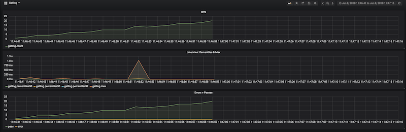

### Throughput Based Tests Curve
Documentation from (https://gatling.io/docs/2.3/general/simulation_setup/)

To launch these simulations 
See example: `TestInjectionThroughputBased`


Here we try to show a simulation where we used Throttling.
In this simulation we try to simulate the progressive increment of Virtual Users per second:

```

 ScenarioTest.scn.inject(constantUsersPerSec(400) during( 60 seconds)).throttle(reachRps(20) in (20 seconds),jumpToRps(10))

```

as you can see in this simulation we call any scenario; in this case we choose the scenario that only call the home page of any url; then we use to inject data  the native function constantUsersPerSec() after we defined the parameters we  use the method "throttle" inside this we use some functions that we going to explain next:

```
reachRps(target) in (duration)
```
this function target a throughput with a ramp over a given duration.

```
jumpToRps(target)
```
whit this function jump immediately to a given targeted throughput.

you can use too

```
holdFor(duration)
```
this function hold the current throughput for a given duration.


