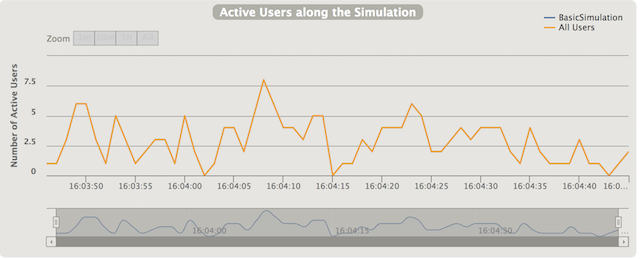

###Constant User Per Sec Normal and Random
Documentation from (https://gatling.io/docs/2.3/general/simulation_setup/)

To launch this simulation 
See example: `TestInjectionConstantUsersPerSecNormal`

When we used the normal type of the simulation we can injects users at a constant rate, defined in users per second, during a given duration. 
Users will be injected at regular intervals.

```
 setUp(
    ScenarioTest.scn.inject(constantUsersPerSec(users) during(totalTimeMin minutes))
  ).protocols(httpConf)
```


###Constant User Per Sec Random
Documentation from (https://gatling.io/docs/2.3/general/simulation_setup/)

To launch this simulation 
See example: `TestInjectionConstantUsersPerSecRandom`

You can see that Injects users at a constant rate, defined in users per second, during a given duration. 
Users will be injected at randomized intervals.

```
setUp(
    ScenarioTest.scn.inject(constantUsersPerSec(users) during(totalTimeMin minutes) randomized)
  ).protocols(httpConf)
```


