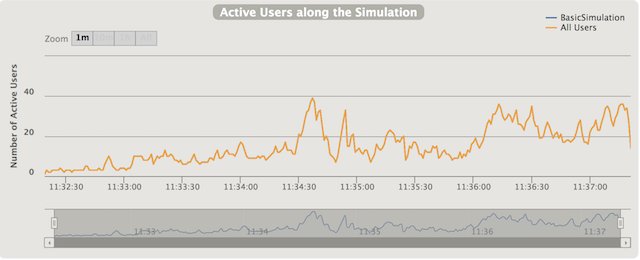

### RampUsersPerSec

Documentation from (https://gatling.io/docs/2.3/general/simulation_setup/)

To launch these simulations 
See example: `TestInjectionsRampUsersPerSec`


On this simulation we try to show you how to split users; 
the case was: "inject 2 users per sec to 10 users per sec during 5 minutes".

```
  setUp(
    ScenarioTest.scn.inject(rampUsersPerSec(2) to (10) during(5 minutes))
  ).protocols(httpConf)
```

this function injects users from starting rate to target rate, defined in users per second, during a given duration. Users will be injected at regular intervals.


 