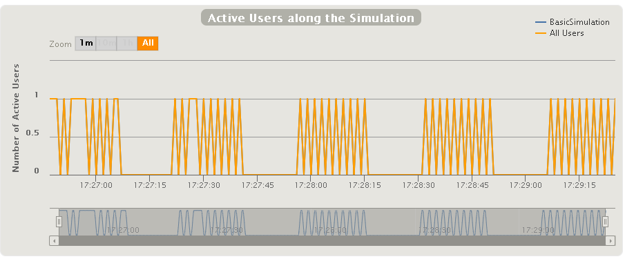

### Split Simulations
Documentation from (https://gatling.io/docs/2.3/general/simulation_setup/)

To launch these simulations 
See example: `TestInjectionSplit`


This is the full code:
~~~
ScenarioTest.scn.inject(splitUsers(totalUsers.toInt).into(rampUsers(10) over (20 seconds)).separatedBy(15 seconds))
~~~


Specify the number of users that will be separated:
```
splitUsers(totalUsers.toInt)
```

Specify how it will be separated: using rampUsers and it will be separated every 15 seconds without sending users:
```
into(rampUsers(10) over (20 seconds)).separatedBy(15 seconds)
```


Result with 50 users:


